----------
title: Algorithmic Compositional Techniques Developed for "Pleonid"
author: Stuart Popejoy
date: 2016-10-30
----------

Abstract
===

"Pleonid" is an algorithmic composition for quintet premiered in May
2012.  It is generated, arranged and scored entirely by software. This paper
describes the largely generative methods employed, including a
novel re-working of the "Tone Clock" by Peter Schat, as well as a new
use of *braids* as both a motif- and counterpoint-generating
techique.

Introduction
===
Pleonid is both a piece that was performed live in May 2012 by musicians
reading from a score, as well as a software program. The software builds a piece
from three types of sections: "melody" passages instruct musicians
to freely interpret written motives; "vamp" sections feature a soloist
improvising freely over a fixed, repeating chordal accompaniment; "braid"
sections are through-composed, contrapuntal vignettes.

The quintet piece from May 2012 is but a single parameterization of the software,
however. The melodic material, "gamut" (a term I use to describe pseudo-octave intervals
other than 12-note), the number of instruments, and instrument-transposition
scheme (related to gamut) are all examples of parameters that can be changed,
producing entirely new if related compositions.

This paper uses the term "Pleonid" to refer to both the software and the piece.
When a particular phrase or note configuration is mentioned, this reflects examples
drawn from the particular piece. Techniques and methods however refer to the
software and any piece that might be generated from it. [Appendix A](#appendix-a) lists all the parameters
required by the program.


Generative Techniques for Pitch Sequences
=========================================

The software's first task is to generate a body of pitch-sequence material. It uses
a single pitch sequence as input to get started.

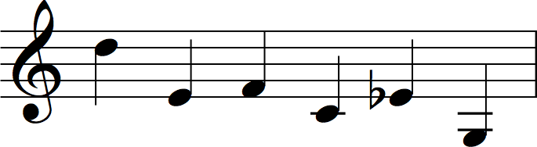

The pitch-class set of the source melody is determined. In Pleonid this is `[0,2,3,4,5,7]`,
Forte no. [6-8](https://en.wikipedia.org/wiki/List_of_pitch_class_sets).
However this is not used for pitch-set transformations but as a concrete scale.

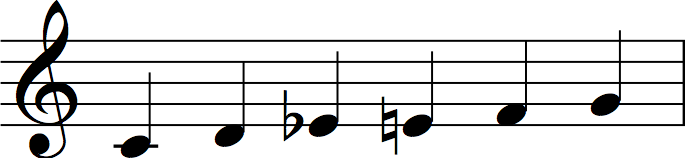


Finding all scales in the source scale
-------------------------------------

The first elaboration finds every "sub-scale" or chord that can be
built from the main scale. This is done by computing every ordered
sum possible in the scale's interval vector.
For example, the sequence `C D E F` has intervals `[2,2,1]`.
The resulting tuples are `[[2,2,1],[2,3],[4,1],[5]]`.

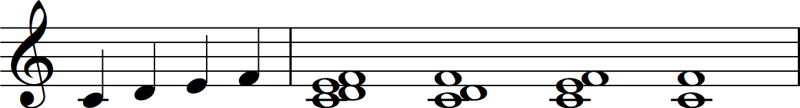

Performing this operation on the Pleonid interval vector `[2,1,1,1,2]`
produces 15 tuples (the final dyad is discarded, as too trivial a "scale").

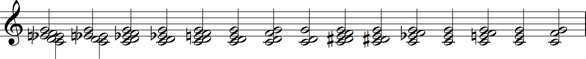


Steering Scales: a modified Tone Clock
====

The scales produced are now used to generate pitch sequences, using
techniques inspired by the "Tone Clock" of Dutch composer Peter Schat.^[Schat, Peter
(1993). Also see <http://en.wikipedia.org/wiki/Tone_Clock> and
<http://www.peterschat.nl/clockwise.html>. Thanks to Jochem van Dijk
for hipping me to it.] In the Tone Clock, triads are classified with their inversion:
the major triad, represented by the intervals `[4,3]`, forms a class or "hour" with
its inverse, the minor triad `[3,4]`, and so on. The 12-tone scale has
12 triad classes or "hours", thus the Clock metaphor.

Schat then shows that for each triad class, there is a fixed number of configurations
by which placements of the triad and its inversion can saturate all 12 notes, or form a row
in dodecaphonic terminology. Schat calls these configurations *steerings*, as though the
triad class is being "steered" through the 12-tone space.

For example, the major/minor triad class has exactly two possible steerings: major at 0, minor at 2,
major at 6, and minor at 8; and minor at 0, minor at 2, major at 4, major at 6. It is noteworthy
that each triad steering produces a tetrad of the triad roots, here `[0,2,6,8]` and `[0,2,4,6]`.^[For Schat the tetrads produced by a steering can be related
intervallically to other triad hours in the clock, producing a relationship between hours.]

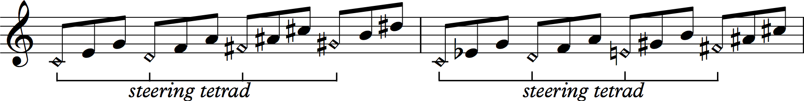

The 12 triad classes produce 33 steerings in total.

Steerings in Pleonid
--------------------

In Pleonid, Schat's triad classes are expanded to accept any chord size or "N-ad". With tetrad and larger chords, inversion is too limited as a classifying
method; we use the more general *rotation* of chord intervals to find all class members.
For triads, rotation and inversion are isomorphic: the major triad class `([3,4],[4,3])` represents all rotations of `[4,3]`.
For tetrads, three such rotations are possible: the tetrad `[1,3,2]` produces the class `([1,3,2],[3,2,1],[2,1,3])`.
Pentads will have four class members, and so forth.

![Rotations of the tetrad [1,3,2].](figures/pleonid/03a-tetradRotation__small.png)

Additionally, steering is expanded to configure an arbitrary gamut, instead of just the
12-tone space; in Pleonid the gamut of 10 is used. This however
means that the full saturation is not
always possible, as the chord size might not evenly divide into the gamut: a triad
for instance will not "place" into a 10-gamut using up all pitches.
Thus, the constraint of full saturation is removed: *maximal* saturation
of the gamut is found, when total saturation is not possible.

Lastly, a steering means there must be at least two placements: if a chord cannot be
placed with its class in any way in a gamut, it is rejected altogether.


Steering algorithm
------------------

The search for all valid configurations of a tuple class in a gamut
begins with the observation that every N-ad is steered by another
"M-ad" where `M` is N integer-divided by the gamut. Thus a triad is steered by a tetrad in
the 12-gamut: `12 / 3 = 4`. In a 10-gamut, a triad would be steered by some
other triad: `10 / 3 = 3` (truncated), and a pentad by a dyad: `10 / 5 = 2`.

The search thus enumerates every M-ad in the gamut, and makes candidate steerings
by placing each possible N-ad rotation at each position specified by the M-ad.
Candidates are filtered for collisions and duplicates,
producing the final result.

One interesting result of using gamuts other than 12 is "gamut-wrapping": chord
placements that "wrap" around the gamut boundary are modulo-remaindered to the
appropriate gamut degree. In a 12-gamut, this results in the same chroma, but in
other gamuts, different chromas result, as illustrated below.

For example, finding all steerings of the 5-tuple `[2,1,2,2]` in a 10-gamut
means searching every possible dyad (90 total) with every possible
rotation (4 total) resulting in 360 candidates. Some optimizations are possible,
for instance dyads having intervals larger than 1/2 the gamut size are
"un-steerable". For this 5-tuple, just 2 steerings are found.

![Steering [2,1,2,2] in a 10-gamut.](figures/pleonid/05-pleoSteering3.png)

The last tuple of the second steering illustrates gamut-wrapping.
The rotation of the interval `[2,2,1,2]` puts the last
`B` above the gamut boundary of `Bb`; modulo wrapping results in a `C#`.
This illustrates how non-standard gamuts create melodic interest: in a 12-gamut,
wrapping notes above the gamut result in the same chroma;
here, having a `C#` instead of a `B` adds new pitch
information to the composition.

Of Pleonid's 15 tuples produced above, 3 tuples are un-steerable but
the rest are quite productive, producing 49 distinct steerings.

Preserving seed melody features
----------------------------------------

While all 49 steerings are created from a single scale, the steerings introduce
a great deal more pitch information which obscures any relationship to the
original material. The attempt to recover and amplify this relationship
starts by filtering out sequences that do not have at least one steering chord
composed entirely of seed-scale pitches.

From the 5-tuple example above, the second steering `([0,2,3,5,7],[4,6,8,9,1])` is allowed,
since the first tuple is made from intervals contained in the `[0,2,3,4,5,7]` seed scale.
However, the first steering `([0,1,3,5,7],[2,4,6,8,9])` is discarded, since both tuples
have intervals  outside of the seed scale.

This filter reduces the 49 steerings to 32. The tuples then undergo
a mapping procedure, designed to map any scale tones back to the
register they appear in the original seed sequence. So for instance, if a
`G` appears in a chord, it would be mapped to below middle-C.

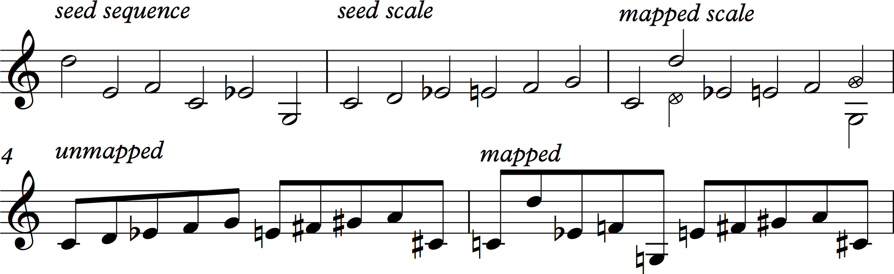

Unfortunately, I did not verify these original results carefully, as I discovered
later: a bug in the code in fact results in a fairly chaotic remapping of pitches.
^[The bug was discovered only in a later effort to migrate the entire Pleonid program from
Java to Haskell. While I'm tempted to credit Haskell's superior expressiveness as the
reason for discovering the bug, it's really because of the extensive code-review that resulted
from performing the migration.]

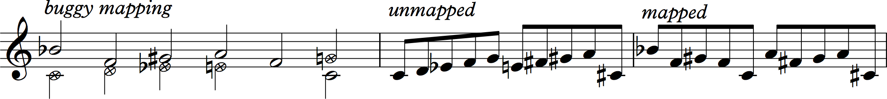

Thus, this attempt to preserve seed melody features fails: by mis-assigning pitches
found in the original pitch-set, values reflecting the seed melody are *more distorted*
than other values. Nonetheless, it creates more intervallic motion than would otherwise
be present.^[The Haskell code base in fact preserves
all of the original bugs and quirks of the Java codebase, in order to exactly reproduce
the Pleonid piece; however as the appendix shows, it is possible to parameterize the new codebase
to operate "bug-free", producing a different piece.]


Pitch sequences from steerings
-----------------

The 32 modified steerings are made into pitch sequences or "lines" by arpeggiating
the tuples constituting the steering, and then interleaving the results.

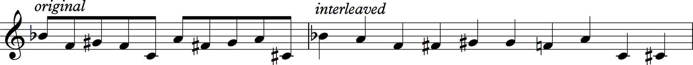

Monotonically increasing or decreasing lines are filtered, removing one result. 31
sequences remain, representing the totality of intervallic material used in the composition.

Rhythm + Pitch = Motif: Braids for Rhythmic Generation
===============================

The 31 sequences are given rhythmic character to form the main motivic "lines" of
the piece. This is accomplished
by projecting the pitch sequences onto a strand of a *braid*.

Braids are 2-dimensional representations of knots, used in a [branch of mathematics](https://en.wikipedia.org/wiki/Knot_theory) that
seeks to describe and understand the essential features of knots, with applications in
bioinformatics, fluid mechanics and cryptography. Braids themselves form a
[group](https://en.wikipedia.org/wiki/Braid_group), but most significantly for Pleonid,
they present a cartesian-style left-to-right "plot" of information that
resembles music notation or "piano rolls".


Musical interpretation of a braid strand
----------------------

A braid is built from "strands" which proceed from left to right, crossing
over or under other strands as it weaves through the braid representation. The
musical interpretation reads each strand as a pitch sequence changing in
time, with the x-axis representing a time quanta (an eighth-note in Pleonid),
and the y-axis *indexing* pitch degrees from some pitchset.


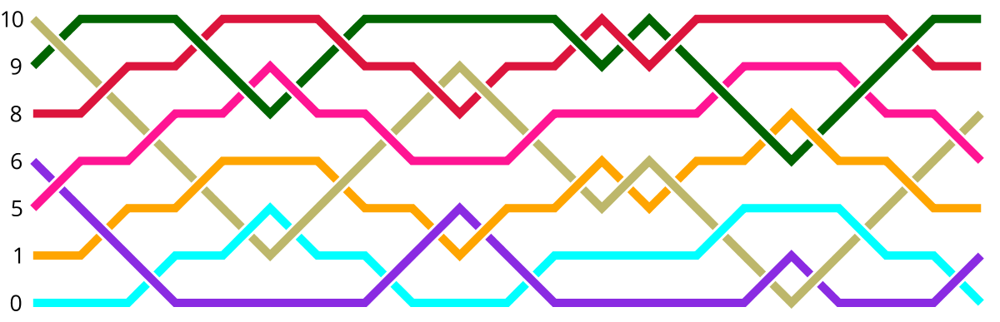


The polarity of a cross -- whether a strand passes over or under another strand -- is used
to decide when a strand sounds a particular pitch. An over-cross or flat cross sounds the indexed
pitch, whereas an under-cross continues the pitch started in a previous cross. Under-crosses at the
beginning of a strand are removed.^[Handling of initial under-crosses is perhaps a bug, as by removing
them, the rhythmic projection is distorted. A parameter in the Haskell code now governs whether to remove
or convert to an initial rest.] For instance, in the braid above, the strand starting at `10` begins
with an over cross, sounding the pitch `10` through the following 4 under-crosses. It then over-crosses
at `1`, and again at `5`, resulting in two new notes.


Projecting a pitch sequence as a strand
---------------------------------------

Using the rules above, the generated pitch sequences are each "projected" as a strand of
a braid. The sequence is analyzed to generate a pitch index for the Y-axis, and the strand
starts at the first pitch, immediately travelling to the second. This method results in
pitch transitions taking longer for more "remote" pitches.


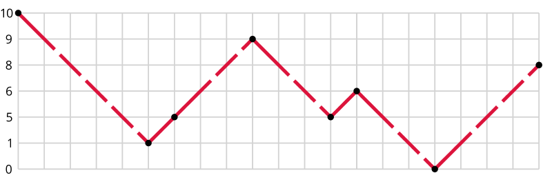

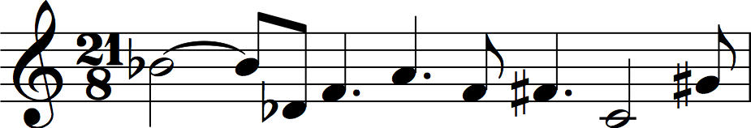


The last note of a strand presents a problem with this interpretation, as it has no length
information. In Pleonid, we simply assign this last note the minimum duration, an eighth-note.

By projecting the 31 sequences onto strands, we have now provided rhythmic information to arrive
at 31 melodies or motives. These are used in the "interpretive" sections of the piece, where a musician
uses a melody to ground structured improvisation.

Elaboration: Braids for Counterpoint
====

The creation of a strand actually specifies an entire braid in itself,
but not a very musically-interesting one, with other strands sustaining
their indexed pitch until they encounter the source strand.

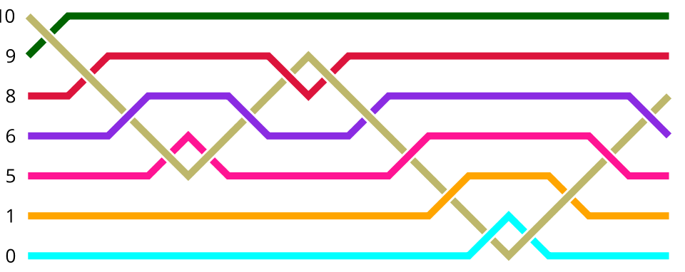

In Pleonid, braids are further
elaborated using a "terracing" strategy, vertically inverting and reflecting the source strand material.

Each transition in the source strand is seen as a "column" or "step", being either
UP, DOWN or FLAT; the cross type is identified as OVER or UNDER. Moving away vertically from
the strand step, FLATs and crosses are alternated; when a cross is
generated, it is "reflected" from the previous cross --  a DOWN becomes an UP
and an OVER becomes an UNDER. The alternating flats and inverting crosses
produces a visually "terraced" effect. At the vertical edges, duplicate FLATs are
inserted if a cross would violate the braid boundary. ^[Here too a "bug" was discovered in the original code, where the terracing
procedure was slightly different when moving downward from the strand as opposed to upward.]

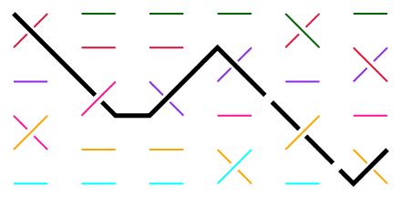

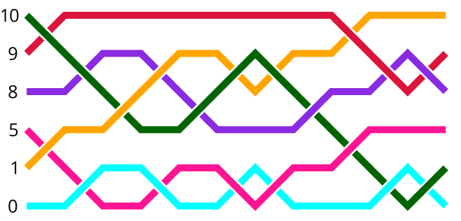

The resulting braid now has more motion in the non-source strands, and importantly
has more *looping* than the minimal braid.

Braid Loops
-----------------

When a braid strand terminates at a different Y-position than where it started, it is seen as joining
the strand starting at the ending Y-position of the first. The integrity of the braid representation
means that this strand will too end at a different position, eventually forming a "loop" that joins back
with the starting strand. A complex braid of many strands may indeed represent a single loop.

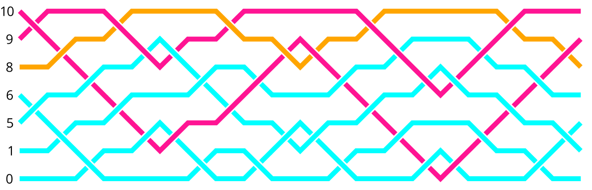

Loops have compelling musical properties, as interpreted in Pleonid: a loop length will always
be a multiple of the "braid length" or number of steps. If the braid length is a "bar",
single-strand loops repeat every bar, while 2-loops only repeat every two bars, and so forth,
creating easily discernable temporal interplay between parts. In Pleonid loops, not strands,
are assigned to parts, so two braids of the same "height" will often have different polyphony.

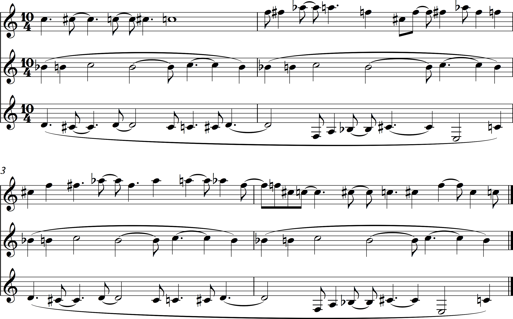

In the figure, the braid loops shown above are orchestrated for three parts, using a 10-semitone register divide.
The top staff has the longest loop, lasting the full 4 bars. The second staff has the shortest loop, repeating a
one-bar figure 4 times. The third staff has a 2-bar figure, repeated twice.

The 31 melodic figures thus create 31 contrapuntal passages, forming the "braid" sections of the piece.

Braid "Vamps"
============

The final generative procedure filters each of the 31 braid passages to find simultaneous note onsets across all parts.
The note lengths are matched to the longest note in the onset group.

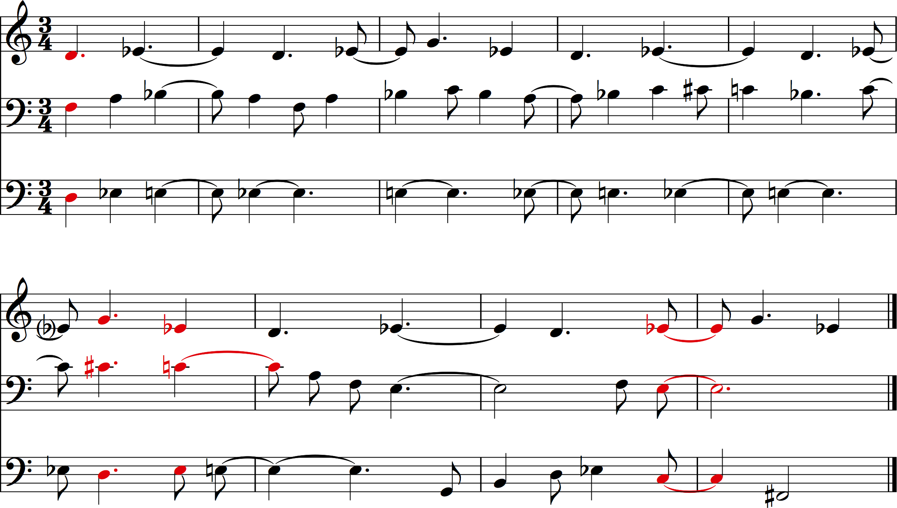

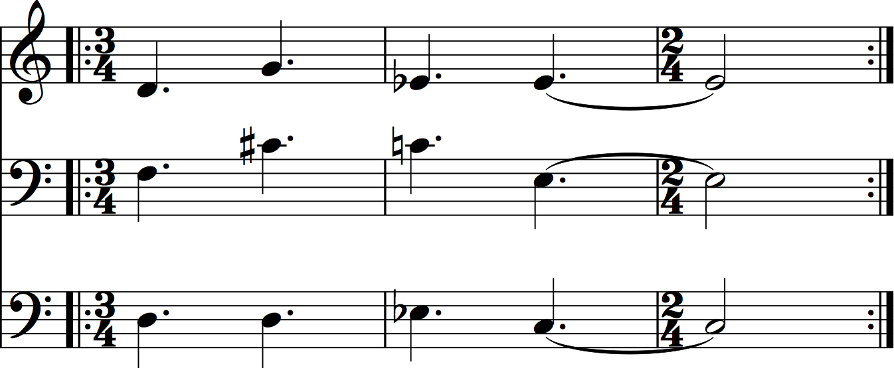

These form the "vamp" sections. As the chord sections are generated, the software keeps track of a "soloist" index
which is advanced for each section, skipping those who are playing; this selects an instrument to be instructed
to improvise freely over the chordal accompaniment.


Arrangement and Orchestration
==

With all musical material now generated, the piece is ready to be assembled.

Voicing instruments
---

As each section is generated, it is "voiced" for the quintet by offsetting each part by the
gamut "register" of 10 semitones.

Pleonid is arranged for violin, alto saxophone, vibraphone, trombone
and electric bass, with the generated material being generated around `C5`, in the soprano range. Thus as the
part index increases, 10 semitones are subtracted, which worked well for the instruments except vibraphone.
Some notes fell beneath the vibraphone range, for which special-purpose code adjusts individual bars up as necessary.

As seen in the "chordal" sections, the gamut-register 10 results in sonorous, "wide" voicings with plenty
of intervallic interest.

Pseudorandom behavior with a LFSR
---

The construction of the piece is by pseudo-random selection of one of three section types, representing
the three bodies of material generated: lines, chords, and braids. Preferring a parameterizable, deterministic and
low-entropy solution, I use a [linear feedback shift register (LFSR)](https://en.wikipedia.org/wiki/Linear-feedback_shift_register) to produce a stream of on-off values. In Pleonid, this LFSR is parameterized with a bit length of 5 and tap
points of 2 and 4.

```{.haskell}
data LFSR = LFSR { _lState :: [Bool],
                   _lTap1 :: Int,
                   _lTap2 :: Int }
            deriving (Eq,Show)

-- | Create an LFSR with initial True values.
-- | Errors not handled (like taps > length) for brevity.
initLFSR :: Int -> Int -> Int -> LFSR
initLFSR len tap1 tap2 = LFSR (replicate len True) tap1 tap2

-- | Feed head with XOR of tap points.
shift :: LFSR -> LFSR
shift (LFSR register tap1 tap2) = LFSR (gen:init register) tap1 tap2
    where gen = register !! tap1 /= register !! tap2

> mapM_ (print . _lState) $ take 6 $ iterate shift $ initLFSR 5 2 4
[True,True,True,True,True]
[False,True,True,True,True]
[False,False,True,True,True]
[False,False,False,True,True]
[True,False,False,False,True]
[True,True,False,False,False]
```

The code example shows the Pleonid LFSR stepping through six iterations,
pushing a new boolean value atop the 5-value list each time.

Stepwise section selection
---

Section type selection is controlled by two values, the section type itself,
which can be in the ordered range of `[Chord,Line,Braid]`, and a "step direction", an integer
value that ranges between `(-1,0,1)`. The LFSR is sampled, which then increments
the step direction up or down, wrapping around such that a `False` value with
a direction of `-1` wraps to `1`, and so forth. This direction is then applied to the section
type value, which in turn wraps: `Braid` increments up to `Chord` and down to `Line`.
The effect is to "slew" or smooth the random LFSR to follow the section type sequence
in one direction or another.

In Pleonid, the section type is initialized to `Chord` and the direction to `0`. The LFSR
is iterated and sampled, which gives `False`. This results in a direction of `-1`, which
wraps the section type to `Braid`. Thus the piece starts with a Braid section. The first 5 bars
are summarized in the following table:

LFSR       Direction       Type
-----      ----------      -----
`False`    `-1`            Braid
`False`    `1` (wrapped)   Chord (wrapped)
`False`    `0`             Chord
`True`     `1`             Line
`True`     `-1` (wrapped)  Chord

Section rendering
---

The "lines" sections are the only ones requiring assembly at this late stage. The LFSR's length
comes into play here, as it is used to select which instruments will play in a given lines section.
When the fourth section is dertermined to be `Line`, the LFSR reads `[True,False,False,False,True]`.
This means the violin (instrument 1) and the bass (instrument 5) are selected to play together.
The first two lines are "popped off" the lines list and given to the two instruments to interpret.
As a result, lines are used much more frequently than chord or braid sections, so the lines are
stored in a "cycling list", repeating indefinitely.

Meanwhile, when a chord or braid section is selected,
that section is "popped off" the list permanently, and the piece ends when one of these lists is empty.
in Pleonid, the braids run out first (with only 2 chord sections left), so the piece ends with a braid section.
In total, 79 sections are thus generated.


Scoring and representation
---

Scoring is accomplished by rendering the music data as MusicXML, and using Sibelius software to
load and print the parts. MusicXML representation can be done with my open-source libraries
which are listed in [Appendix B](#appendix-b).

The hard part of output is not the XML transformation, but beating
the data into a shape that can be read by musicians. Toward this end, a lot of work is done
to have proper note-lengths (ie, a 5/8 note is not notatable, but must be written as a quarter
tied to an eighth) and to auto-select bar lengths to avoid brutal time signatures like `21/8`.
This work is beyond the scope of this paper, but code for tie rules and re-barring phrases can
be found in the open source code.

Conclusion
===

Pleonid represents my most far-reaching work in algorithmic composition, but in truth I've only
scratched the surface. Just exploring the possibilities of the [parameters](#appendix-a) alone
represents new works waiting to be realized.

Braids also have far more promise than just my
treatment, as my musical interpretation is by no means the only way to use this way to structure
data with such formal regularity; work can be done also on using some of the braid isotopy transformations
(Reidemeister moves) to see what kinds of contrapuntal transformations might ensue.

The purpose of this paper is to document these approaches in hopes that they will inspire new
work by more composers in the realm of generative, algorithmic software. I also feel like the interaction
of algorithmic composition with improvisational performance is very fertile, as reflected also in
the work of Anthony Braxton and others.


Appendix A: Input Parameters {#appendix-a}
===

The Pleonid software accepts the following input parameters:

Parameter             Description
----------            ------------
`gamut`               Gamut pseudo-octave value, used in steerings.
`line`                Source pitch sequence.
`transposer`          Voicing/register function, in Pleonid set to offset by 10 semitones.
`scaleMapper`         Function to map steerings to scale pitches, parameterized to mimic bug in the original Java code or use new "fixed" version.
`filterRestsInBraids` When true, drop any initial "under" crosses, resulting in rhythmic disparities in the original codebase. False instead puts a rest in its place.
`scaleSize`           A separate gamut value used in scale mapping, and in pitch-set discovery. Pleonid uses the standard 12-octave.
`lfsr`                A parameterized LFSR object. Pleonid's is parameterized with 5 slots with taps at 2 and 4.
`parts`               A list of part metadata, including names and clefs, also dictating the number of parts.


Appendix B: Relevant open-source libraries by the author {#appendix-b}
===

fadno
---
[https://github.com/slpopejoy/fadno](https://github.com/slpopejoy/fadno)

Provides music primitives, like a polymorphic note and note-list "bar" datatype. Uses
`fadno-xml` to render output to MusicXML, and can also produce midi files. Also supports
the advanced barring and note-tying features used in Pleonid in the `Fadno.Meter` module.

fadno-braids
---
[https://github.com/slpopejoy/fadno-braids](https://github.com/slpopejoy/fadno-braids)

Provides the braid representations used by the Haskell version of Pleonid, plus graphics utilities
used for this paper.

fadno-xml
---
[https://github.com/slpopejoy/fadno-xml](https://github.com/slpopejoy/fadno-xml)

Provides a type-model of MusicXML 2.0, generated automatically from the music-xml-2.0 xsd.
Attempts to provide a general-purpose XSD-to-datamodel code generator, but that so far only
works on MusicXML :)
