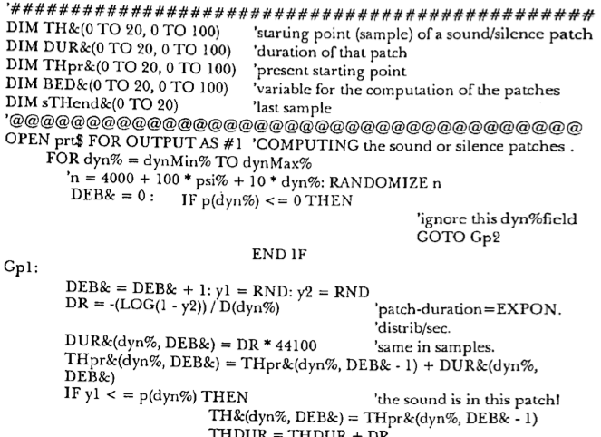

% Composing (Music) in Haskell
% Stuart Popejoy
% March 16, 2016

# Composing with Code

##

## WHY????

- Isn't composing music hard enough???
- Getting a computer to "talk music" is really hard

##



##

```{.javascript}
nums = [n1,n2,n3,n4,n5,n6]; denoms = [d1,d2,d3,d4,d5,d6];
preds = (nums +++ denoms).collect
   { | pair| pair[0] > 0 * pair[1] > 0 };
preds.do { | pred |
  lastNZ = if (lastNZ == nil, { pred }, { lastNZ + pred }); };
freqs = (preds +++ (nums/denoms)).collect { | pr |
	Select.kr(pr[0], [1, pr[1]]); };
ifreqs = nums.size.collect { | i |
	Select.kr(lastNZ, Array.series(i+1,1,0) ++ (denoms/nums)); };
ug = SinOsc.ar(freq); udc = DC.ar(1);
[preds +++ freqs, preds +++ ifreqs].lace.do { | pf |
	var p, f;
	#p, f = pf; freq = freq * f;
	ug = ug * Select.ar( p, [ udc, SinOsc.ar(freq) ]); };
Out.ar(out, ug * amp);
```
Supercollider code

# Why Compose in Code

- Elaboration
- Experimentation
- Growth

<div class="notes">
- Elaboration: compositional approaches
- Experimentation: explore a space, find new sounds
- Growth: mine, as s/w dev and musician together
</div>

# Cyclops

##

- generated 619 riffs from one seed motif
- used 18 (including seed)

## "Mod Diff"

```{.haskell}
differ mod' bias seed s = zipTail calc s ++ [calc (last s) (head s)]
  where
    calc l r = (((r - offset) - (l - offset)) `rem` mod') + offset
    offset = (rng `div` 2) + bias + minimum seed
    rng = maximum seed - minimum seed

seed = map toPitch [E3, A3, E3, D3, G3, D3]

gen n = iterate (differ n 0 seed) seed

genRot n r t =
   pivot $ take t $ iterate (rotate r . differ n 0 seed) seed

```

## `zip` \``ap`\` `tail`: the Aztec god of consecutive numbers

```{.haskell}
zipTail :: (a -> a -> c) -> [a] -> [c]
zipTail f = zipWith f <*> tail
```
(#haskell `@quote quicksilver aztec`)

<div class="notes">
An example of the bountiful help received on #haskell IRC,
zipTail all over my music code.
</div>

## Numbers are fun!!

```
> head $ genRot 9 2 48
[52,51,60,57,60,61,57,54,49,45,51,46,51,48,61,57,54,58,54,51,55,51,57,52,
57,45,58,45,60,46,60,48,61,48,54,49,54,51,55,51,57,52,57,45,58,45,60,46]
```
*but how do you _play_ it?*

# Notation


# Music XML

## Alternatives

- Lilypond
- ???

## Implementations

- `musicxml` (Samuel Silva)
- `hts` (Rohan Drape)
- `musicxml2` (Hans Hoglund)

<div class="notes">

musicxml: last updated in 2009, HaXml

hts: Super idiosyncratic, no docs

musicxml2: Hardcoded xml datamodel, number-unfriendly pitch model

</div>


## Rolling my own

- NOT NIH!
- Used `jaxb` in Java
- Handrolled in Clojure

<div class="notes">

NIH: Really didn't want to do this.

</div>


# `fadno-xml`

- available
